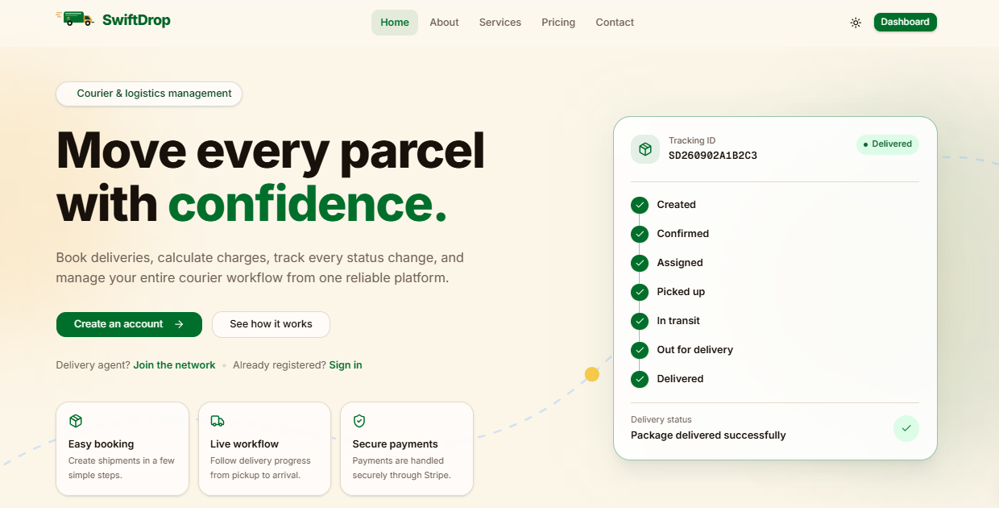
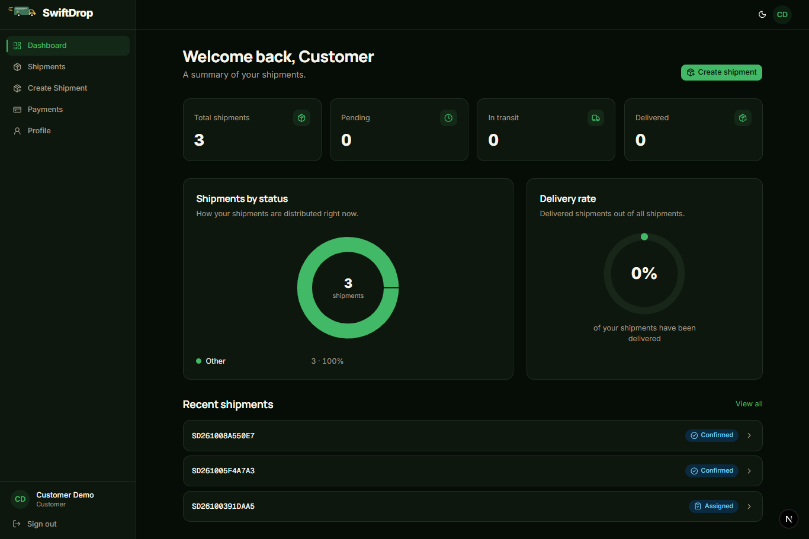
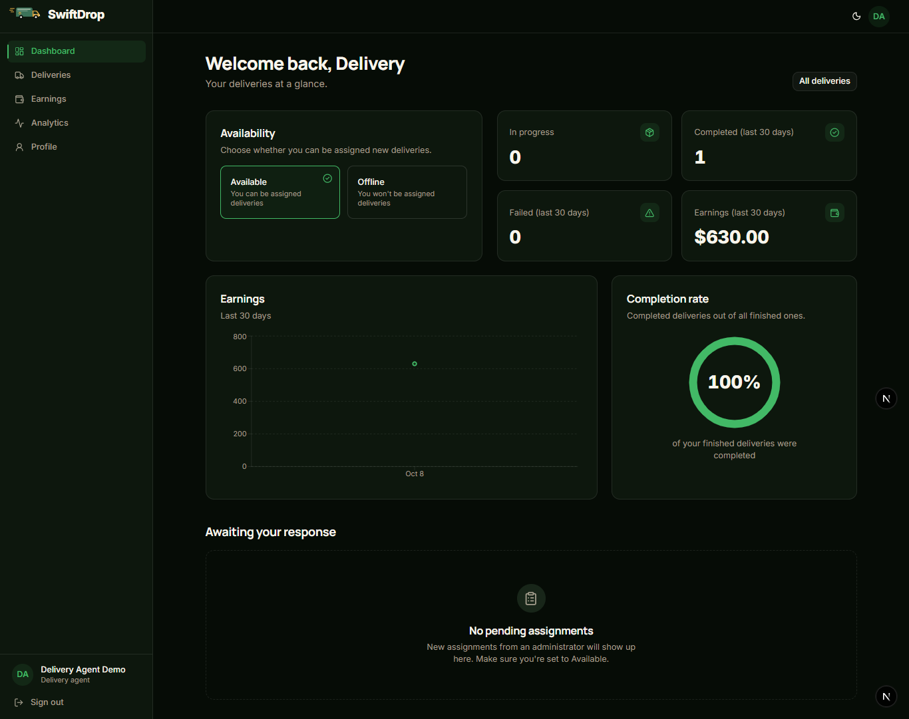
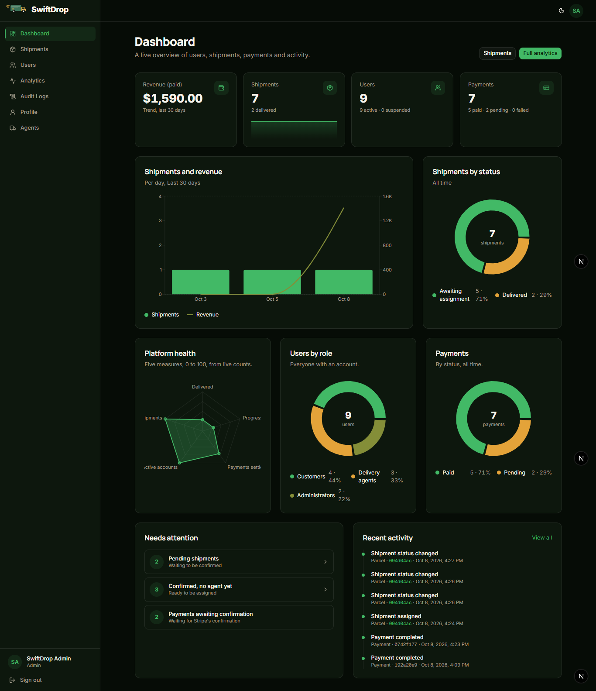
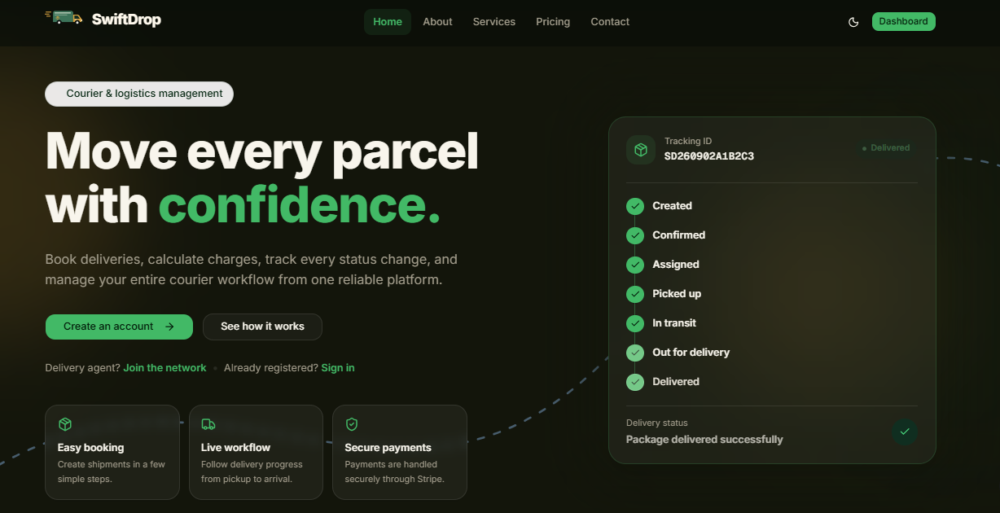
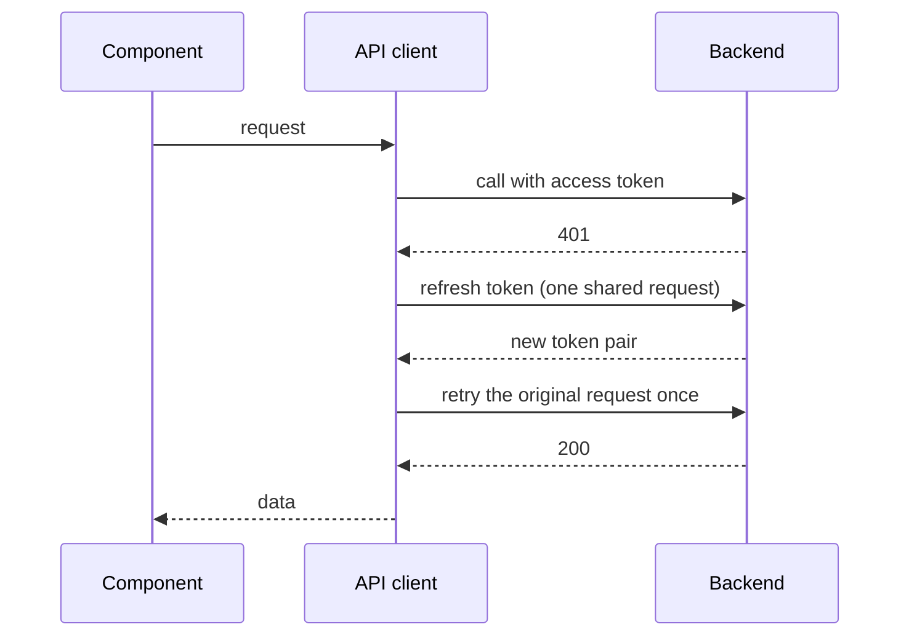
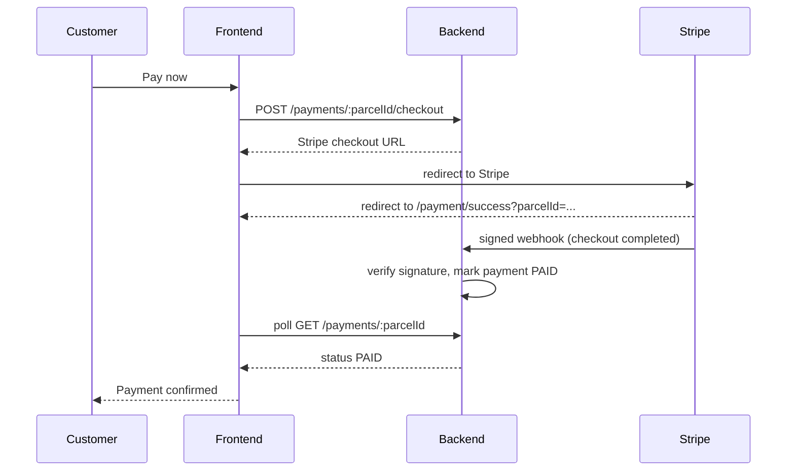

# SwiftDrop Frontend

The web application for **SwiftDrop**, a courier and logistics management platform. It gives customers, delivery agents and administrators their own workspace on top of one existing backend API.

- **Live site:** https://shiftdrop-service.vercel.app
- **Backend API:** https://shiftdrop-platform-backend.vercel.app/api/v1

Every workflow talks to the real deployed API. There is no mock data for shipments, payments, earnings, analytics, users or audit logs.

## Screenshots

| Home |
| --- | 
|  |


### Customer

| Dashboard |
| --- |
|  |


### Delivery agent

| Dashboard |
| --- |
|  |

### Administrator

| Dashboard |
| --- |
|  |


### Dark mode

| Dark mode | 
| --- |
|  |

## Features

### Public site
- Home, About, Services, Pricing and Contact pages with per-page metadata, Open Graph tags, a generated share image, `robots.txt` and a sitemap.
- Light and dark themes. The contact form has no backend endpoint yet, so it validates input and shows a clear "demo only" result rather than pretending to send.

### Customers
- Dashboard with animated shipment counts, a status breakdown donut chart, a delivery-rate ring and recent shipments.
- Shipment list with URL-synced search, status filter, sorting and pagination.
- Create-shipment wizard (sender, receiver, parcel, service, review). The delivery charge is calculated by the backend and is never sent by the client.
- Shipment detail with a status timeline built from the real status history, and cancellation while a shipment is pending or confirmed.
- Stripe Checkout, payment history, and success and cancel pages that confirm a payment only when the backend reports it as paid.
- Profile management.

### Delivery agents
- Dashboard with availability control (Available or Offline only), performance numbers, an earnings area chart, a completion-rate ring and pending assignments.
- Deliveries list and detail. Accept, decline, pickup and status actions come from the shipment state machine, so invalid actions are never offered.
- Earnings (deliveries and earnings combined chart plus an area trend) and analytics (status donut, delivery profile radar, trend area chart, completion ring).
- Profile management, including vehicle details.

### Administrators
- Dashboard with KPI cards and sparklines, a shipments-versus-revenue combined chart, status, user and payment donut charts, a platform-health radar chart, a "needs attention" panel and a recent-activity feed.
- Shipment list and detail, with agent assignment and confirm or cancel actions.
- User management (search, filters, suspend and reactivate with confirmation).
- Delivery agents roster with availability overview.
- Audit log with an action filter and readable metadata.
- Analytics page with combined, donut, radar, bar and area charts.

## Tech stack

| Area | Choice |
| --- | --- |
| Framework | Next.js (App Router), React, TypeScript |
| Styling | Tailwind CSS, shadcn/ui components, Lucide icons |
| Server state | TanStack Query |
| Client state | Zustand (session status only) |
| Forms | React Hook Form with Zod |
| Charts | Recharts (lazy loaded): area, bar, combined, donut, radar, sparkline |
| Animation | Motion (`motion/react`): entrances, animated counters, progress rings, with reduced-motion support |
| Notifications | Sonner |
| Tests | Vitest |

## Architecture

```
src/
  app/            Routes. Route groups: (marketing), (auth), (customer), (provider), (admin), plus /payment
  components/     UI grouped by area (marketing, auth, layout, shipments, deliveries, admin, charts, shared, ...)
  config/         Environment, navigation, roles, site and option lists
  hooks/          TanStack Query hooks and URL-state hooks
  lib/
    api/          API client (envelope handling, errors, token refresh) and one module per backend area
    auth/         Token storage, session start, safe redirects
    query/        Query client and query key factory
    parcel-status.ts   Shipment state machine, timeline builder and role actions
    chart-data.ts      Pure helpers that shape API data for charts
  stores/         Zustand session store
  types/          Shared types
```

Key ideas:

- **One API client.** `src/lib/api/client.ts` attaches the access token, unwraps the backend's response envelope, turns failures into a typed `ApiError`, and handles token refresh. Pages and components never call `fetch` directly.
- **Server state is TanStack Query's job.** Zustand only holds whether a session exists. The signed-in user is a query (`useCurrentUser`).
- **List filters live in the URL**, so refresh, back and forward, and shared links all work.
- **Server Components by default.** Client Components are used for forms, interactive lists, charts and anything that needs the signed-in session.
- **The state machine is shared.** `src/lib/parcel-status.ts` mirrors the backend's shipment rules. It decides which buttons to show, builds the timeline, and has unit tests. The backend remains the authority.
- **Charts are isolated.** Each chart is lazy loaded and sits in an error boundary, so a failed chart shows a retry and never takes the page down.

### Token refresh



Concurrent 401s share a single refresh, because the backend rotates refresh tokens. A rate limit or network problem during refresh does not sign the user out; only a definitive rejection does.

### Payment flow



Returning from Stripe is **not** proof of payment. The success page shows "confirmed" only when the backend reports `PAID`, which happens only through the verified Stripe webhook.

## Route map

| Route | Who | Purpose |
| --- | --- | --- |
| `/`, `/about`, `/services`, `/pricing`, `/contact` | Everyone | Public site |
| `/login`, `/register` | Signed-out users | Sign in, create an account, Google sign-in |
| `/dashboard` | Customer | Overview |
| `/dashboard/shipments`, `/dashboard/shipments/new`, `/dashboard/shipments/[id]` | Customer | List, create, details |
| `/dashboard/payments`, `/dashboard/profile` | Customer | Payment history, profile |
| `/payment/success`, `/payment/cancel` | Customer | Stripe return pages |
| `/provider` | Delivery agent | Overview and availability |
| `/provider/deliveries`, `/provider/deliveries/[id]` | Delivery agent | Jobs and workflow actions |
| `/provider/earnings`, `/provider/analytics`, `/provider/profile` | Delivery agent | Earnings, analytics, profile |
| `/admin` | Administrator | Overview |
| `/admin/shipments`, `/admin/shipments/[id]` | Administrator | List, details, agent assignment |
| `/admin/users`, `/admin/agents` | Administrator | Accounts and agent roster |
| `/admin/analytics`, `/admin/audit-logs`, `/admin/profile` | Administrator | Charts, audit trail, profile |

Route guards are a user-experience layer. **The backend is the real authorization boundary.**

## Design system and UX

- **Tokens.** Colors come from semantic CSS variables (background, card, primary, border, chart colors and status colors) with full light and dark themes. Components use tokens only, so a theme change needs no component changes.
- **Motion.** Entrances, animated counters, progress rings and chart animation. Everything respects `prefers-reduced-motion`.
- **Accessibility.** Semantic landmarks, skip links, visible focus, labelled form fields, keyboard-accessible dialogs and drawers (native `<dialog>`), `aria-current` navigation, and status shown with icon plus text instead of color alone. Charts have text summaries and hidden data tables for screen readers.
- **Responsive.** Mobile-first. Data tables turn into labelled cards on small screens.
- **Loading and errors.** Skeletons that match the final layout, empty states with next steps, error boundaries per area and a global fallback.

## Getting started

Requirements: Node.js 20 or newer (developed on Node 24) and npm.

```bash
npm install
cp .env.example .env.local
# edit .env.local, then:
npm run dev
```

Open http://localhost:3000.

When testing the Stripe flow locally, the backend's `CLIENT_URL` must be `http://localhost:3000`. Change it back to the production URL for deployment.

### Environment variables

Only public values are used. Never put secrets in `NEXT_PUBLIC_` variables.

| Variable | Required | Description |
| --- | --- | --- |
| `NEXT_PUBLIC_API_BASE_URL` | Yes | Backend API base, already including `/api/v1` |
| `NEXT_PUBLIC_GOOGLE_CLIENT_ID` | For Google sign-in | Google OAuth client ID (public). Authorized JavaScript origins must include the site's origin |
| `NEXT_PUBLIC_SITE_URL` | Recommended | The site's own URL, used for metadata, the sitemap and share images |
| `NEXT_PUBLIC_CONTACT_EMAIL` | Optional | Shown on the Contact page. When empty, the email card is hidden |

Stripe secret keys, webhook secrets, JWT secrets and database credentials belong to the backend only.

### Scripts

| Command | What it does |
| --- | --- |
| `npm run dev` | Start the development server |
| `npm run build` | Production build |
| `npm run start` | Run the production build |
| `npm run lint` | ESLint |
| `npm run typecheck` | Generate route types, then run the TypeScript compiler |
| `npm run test` | Unit tests |

## Demo accounts

These seeded accounts use the real login endpoint. The login page has one-click buttons for each.

| Role | Email | Password |
| --- | --- | --- |
| Admin | admin@swiftdrop.com | Test123 |
| Customer | customer@swiftdrop.com | Test123 |
| Delivery agent | agent@swiftdrop.com | Test123 |

Payments run in Stripe **test mode**. Use card `4242 4242 4242 4242`, any future expiry date and any CVC.

A quick end-to-end tour: as the customer create a shipment and pay; as the admin open the shipment and assign the demo agent (the agent must be set to Available); as the agent accept, pick up and deliver it; then check the earnings, analytics and audit log.

## Testing

```bash
npm run test
```

Focused unit tests cover the parts where a bug would be costly:

- the API client's token refresh and retry logic (single refresh, one retry, no loops, rate-limit handling),
- the shipment state machine, timeline builder and role actions,
- redirect safety, the Stripe URL check and audit metadata display,
- the chart data helpers.

## Deployment

1. Import the repository in Vercel and keep the Next.js defaults.
2. Add the environment variables above for Production (and Preview if you use preview deployments).
3. In the **backend** project, set `CLIENT_URL` to the frontend URL and add the same origin to the CORS allowlist (exact origin, no trailing slash), then redeploy the backend.
4. In the Google Cloud console, add the frontend URL to the OAuth client's **Authorized JavaScript origins**.
5. Register the backend's Stripe webhook (see below).
6. Smoke test: sign in with each demo role, create a shipment, pay with the test card, and confirm that the success page reaches "Payment confirmed".

Preview deployment URLs are not on the backend's CORS allowlist or in Google's authorized origins by default, so sign-in and API calls may fail there until you add them.

## Stripe webhook troubleshooting

If a payment stays **Pending** after you pay, the backend never received or accepted Stripe's webhook. The payment record shows it: the Stripe payment intent and last processed event stay empty. The frontend is behaving correctly by refusing to claim "paid".

Check, in order:

1. **Endpoint exists.** In the Stripe dashboard (test mode), under Developers then Webhooks, there is an endpoint for `https://<backend>/api/v1/payments/webhook` that listens for `checkout.session.completed`.
2. **Delivery status.** Open that endpoint and look at recent deliveries. A 400 means the signing secret does not match, a 404 means the path is wrong, a 500 means the handler failed (see the backend function logs), and a redirect (307 or 308) means the URL redirects, which Stripe does not follow.
3. **Signing secret.** The backend's `STRIPE_WEBHOOK_SECRET` must be that endpoint's own signing secret (it starts with `whsec_`). The secret printed by the Stripe CLI is a different one. After changing an environment variable on Vercel, redeploy.
4. **Reachability.** `curl -i -X POST https://<backend>/api/v1/payments/webhook -H "Content-Type: application/json" -d '{}'` should return 400 "Webhook signature verification failed". A 404 or 500 points to routing or configuration.
5. **Replay.** After fixing the cause, resend the failed event from the Stripe dashboard. The payment becomes paid without paying again.

## Security notes

- Access and refresh tokens are kept in `localStorage`. This is a deliberate trade-off for a separate-domain frontend, so keep third-party scripts to a minimum and never render user-supplied HTML.
- The client only redirects to `https://*.stripe.com` checkout addresses and only follows post-login redirects inside the user's own area.
- Route guards are a user-experience layer; the backend enforces every permission.
- Admin accounts cannot be created from the frontend.
- No secrets are present in this repository. Only `NEXT_PUBLIC_` values are used.
- Recommended backend settings: a short access-token lifetime (around 15 minutes) and a separate, looser rate limit for token refresh and logout.

## Known limitations

- The contact form is a demo until the backend adds a contact endpoint.
- Analytics periods offer only `30d`, the one value confirmed with the backend. More can be added in `src/config/periods.ts`.
- The audit log can be filtered by action only, because other filters are not documented by the backend.
- The home page hero uses a placeholder illustration (`public/images/hero-demo.svg`). Replace it by changing `src/config/images.ts`.
- Stripe is in test mode.